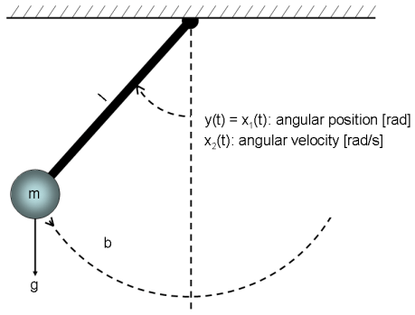
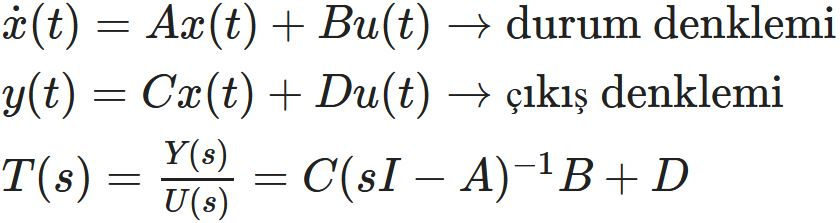
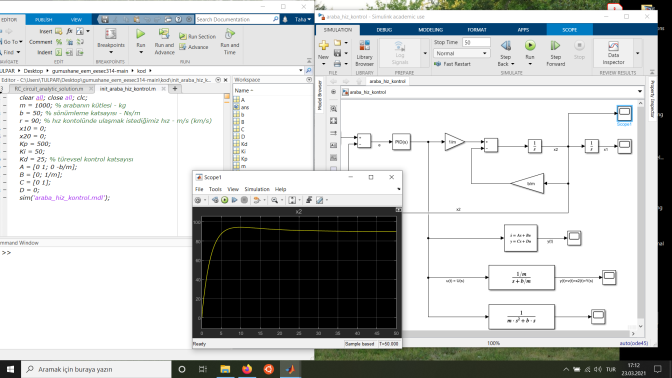

# EESEC 314
## 1. Hafta
**Dinamik sistem** nedir? **Hafızalı sistem**.
Gerilim kaynağı bağlanmış bir resistör-kapasitör devresini (RC devresi - **Şekil 1**) analiz ettik. Burdaki örnekte kapasitörün üzerinden geçen akım iC(t) değil de kapasitörün üzerine düşen voltaj VC(t) hafıza işlevi görüyor. Hafızaya **durum değişkeni** diyeceğiz. Yani bu sistemdeki durum değişkenimiz iC(t) değil de VC(t). Analitik çözümü [1]'de türetilen *RC devresinin zorlanmış cevabına* bakıp sistemlice düşünerek niçin aımın değil de voltajın bir hafıza vazifesi gördüğünü anlamamız gerekiyor. Bu düşünce antrenmanını yedinci hafta bu konuya tekrar dönüp sistemin transfer fonksiyonunu elde etmeye çalışırken derste beraber yaptık. Ama unutmayın derste ne kadar anlatılırsa anlatılsın, eğer kendimiz düşünüp de kendi aklımızın anlayacağı bir biçimde öğrenmeye çalışmazsak maalesef öğrenemeyiz. Bu yüzden verilen referansta eşitlik olarak verilen kapasitörün akım ve voltaj eşitliklerine bakıp düşünelim.

 
 
Burada bir ip ucu: Türev değil de integral operatörüne karışan/bulaşan değişken **durum değişkeni** olacaktır çünkü türev anlık bilgi verirken integral'de başlangıç koşulu vardır ve bu başlangıç koşuluna göre sonuç da farklı olmaktadır. 
**Durum değişkeni:** *Geçmişin geleceği etkileyen özü*1. 
Bu hafta baktığımız RC devresinin durum uzayı modelinde bir tane **durum değişkeni** var, dolayısıyla bir boyutlu bir sistem. Ayrıca *Vcc* olarak isimlendirdiğimiz gerilim kaynağı, sistemin **durum değişkeni** olan **kapasitör voltajına** bir **giriş değişkeni** (input variable) olarak etki ediyor. RC devresinde gerilim kaynağının voltajı *Vcc*, resistör değeri *R* ve kapasitor değeri *C* sistem parametreleri olarak vazife yapıyor. Bu parametreler zamanla değişmediği zaman Sinyaller-Sistemler dersinden bildiğimiz gibi doğrusal zamanla değişmeyen (linear time-invariant - LTI) bir sistemimiz olmuş oluyor ve analiz etmek kolay bir hal alıyor. Sistem parametrelerimiz zamanla değişen bir yapıya sahipse daha kompleks matematiksel yaklaşımlarla analiz yapmak zorunda kalırız.

 
*Şekil 1:* RC devresinin analizi. Burada incelenen cevaba RC devresinin *zorlanmış* cevap denmektedir [1]. 
## 2. Hafta 
**Pendulum** (sarkaç) dinamiklerine durum uzayında (state space) bakış [1]. *Şekil 2*'de görüldüğü üzere, kütlesi ihmal edilen *l* uzunluğundaki çubuğun ucundaki cismin kütlesi *m*, sürtünme katsayısı *b*, yer çekimi ivmesi *g*; sistem parametreleri denilen bu katsayılar sabit (i.e., zamanla değişmiyor). Sistemin durum değişkenleri açı ve açısal hız. Çıkış değişkeni olarak açıyı gözlemliyoruz. Burada analiz ettiğimiz pendulum probleminde sistemimizin bir girişi yok. Gerçek hayatta çubuğun ucuna pervaneli bir motor takılıp çubuğu hareket ettirebilir veya çubuğun baş noktasında (yani döndüğü yerde olan eksen etrafında) bir adım (step) veya servo motor pendulumu döndürebilir. Motorların dönmesiyle sisteme etki edecek olan kuvvet sistemimize bir giriş olarak etki edecektir. Bu konuya altıncı haftada dönüp burada bahsettiğimiz sistem giriş değişkenini (input variable) yani kontrol sinyalini bir denetleyici (e.g., PID) vasıtasıyla oluşturacağız. 
 
*Şekil 2:* Pendulum (sarkaç) modeli ([2]'nin izni ile).
## 3. Hafta
Bir araba için hız kontrolü (**cruise control**) dinamiklerine bakış. Durum uzayı gösterimi (state space representation). Bu hafta ayrıca oransal-integral-türevsel (proportional-integral-derivative) denetleyici (PID controller) tasarlayarak (deneme-yanılma yolu ile) arabamızın hız kontrolünü yaptık. İlgili video DBS'de. 
 
*Şekil 3:* Araba hız kontrolü (cruise control) modeli ([3]'ün izni ile).
## 4. Hafta
Cruise control problemine bakmaya devam ettik. A matrisi sistem matrisimiz, B matrisi giriş matrisi, C matrisi çıkış matrisi olarak isimlendiriliyor. Eğer bir sistemin dinamikleri doğrusal (linear) ise o zaman sistemin zaman alanındaki (time-domain) modelini yukarıda bahsedilen matrisler ve giriş, durum ve çıkış değişkenleri cinsinden **durum uzayı gösterimi** (state space representation) ile tasvir edebiliriz. Bu hafta zaman alanından (time domain) frekans alanına (s domain) geçiş yaptık. Sistemimizin çıkışı (y(t)) olan arabamızın hızı (v(t)) ile girişi (u(t)) olan arabayı çeken kuvvet arasındaki orana s alanında (s-domain) bakarsak transfer fonksiyonu T(s)'yi elde ediyoruz. 
T(s) = Y(s)/U(s) = C(sI-A)-1B + D 
Dersimizin sonunda her hafta yaptığımız gibi MATLAB/Simulink'de teoriklerine baktığımız modellerin simulasyonlarını yaptık. Durum uzayındaki çıkış değişkeni olan arabanın hızının, s-alanında Transfer fonksiyonu ile verilen bloğun çıkışı olan hız değişkeni ile tamamen aynı olduğunu gözlemledik. Dersimizi önümüzdeki hafta sistemin çıkışını hız değil de pozisyon (arabanın konumu) olarak seçip yeni bir transfer fonksiyonu elde edeceğiz diye sonlandırdık.
## 5. Hafta
Cruise kontrol problemindeki arabanın dinamikleriyle (*Şekil 3*) devam ettik. Çıkış olarak hızı değil de pozisyonu seçerek konum bilgisinden geri-besleme aldık. Böylece sistemimizin transfer fonksiyonu da değişmiş oldu. Hatırlayacak olursak **transfer fonksiyonu** s-uzayında (yani frekans uzayı/alanı) çıkışın girişe oranı olarak tanımlanmıştı, dolayısıyla çıkışın başka bir durum değişkeni seçilmesi otomatik olarak transfer fonksiyonunun ifadesinin de etkiledi. Yeni elde ettiğimiz transfer fonksiyonuna dikkat edilecek olursa, paydadaki ifadenin maksimum derecesi iki, yani ikinci dereceden bir polinom. Bu da yeni elde edilen transfer fonksiyonunda iki tane kökün olduğunu gösteriyor. Bu iki kök, iki durum değişkenine (i.e., hız ve pozisyon) tekabül ediyor. Ayrıca PID denetleyicimizin kazançları da yeniden ayarlanmak zorunda kaldı, çünkü artık üretilen kontrol sinyali hız kontrol probleminde olduğu gibi arabayı sabit bir hıza sabitlemeye çalışmıyor fakat arabanın konumunu (pozisyonunu) tek boyutlu kabul ettiğimiz yolda belirli bir referans noktasına/çizgisine götürmeye çalışıyor.
## 6. Hafta
İkinci haftada dinamiklerine göz atıp matematiksel modelini birinci dereceden adi diferansiyel denklemler kullanarak elde ettiğimiz pendulum (sarkaç) problemine geri dönüyoruz. Bu sefer sisteme durum uzayı gösteriminde giriş değişkeni işlevi görecek harici bir kuvveti bir eyleyici (actuator) vasıtasıyla uygulayacağız. Mesela sistemin moment noktası olan ekseni, bir servo veya adım (step) motorun miline geçirebiliriz ve böylece bu eksene uygulayacağımız Tork (Newton x metre) [4] veya *l* uzunluğundaki kütlesi ihmal edilen çubuğun ucundaki *m* kütleli yükün olduğu noktaya bir motor-pervane ikilisi takıp, motor-pervane eyleyicisinin *m* kütlesinin olduğu noktada oluşturacağımız itki kuvveti ile sisteme etki edebiliriz. 
Derste yukarıda anlattığımız güncellemeyi sarkaç sistemine uygulayıp yine bir PID denetleyici tasarlayarak açıyı kontrol etmeyi başardık. Ara sınavımızda karşımıza çıkacak bir sistem. Unutmayın, şu ana kadar baktığımız RC devresi ve araba hız ve pozisyon kontrolü problemlerinde sistemler doğrusaldı. Bu yüzden transfer fonksiyonlarını elde edebiliyoruz bu sistemler için. Fakat sarkaç sisteminde açı durum değişkeninin durum uzayı gösteriminde yazdığımız birinci dereceden diferansiyel denklemlerde görünme şekli sinüs fonksiyonu üzerinden olduğu için sistemimiz doğrusal değil demiştik. Sonuç olarak da sarkaç sisteminin transfer fonksiyonu söz konusu değil. Önümüzdeki hafta ilk hafta işlediğimiz (DBS'de ders kaydı yok ilk haftanın) ve ikinci hafta derste sarkaç sistemi ile devam etmeden kısaca tekrar ettiğimiz RC devresinin durum uzayı gösterimine tekrar göz atıp bu elektronik devrenin/sistemin transfer fonksiyonunu elde edeceğiz. Ardından şu ana kadar tasarladığımız PID denetleyicilerden daha ilkel olan **aç/kapa denetleyici**2 ile sistem çıkışımız olan kapasitör voltajı olan VC(t)'yi kontrol etmeye çalışacağız.   
## 7. Hafta
Tahtada durum uzayı gösterimini tekrar yazacağımız RC devresinin transfer fonksiyonunu dördüncü haftada öğrendiğimiz 
T(s) = Y(s)/U(s) = C(sI-A)-1B + D

 
eşitliğini uygulayarak aşağıdaki gibi elde ettik (dersin tam sonuna denk geldi).

 
Transfer fonksiyonunun paydası **birinci** dereceden bir polinom şeklinde, bu da **bir** durum değişkenimiz olduğunu gösteriyor. Zaten bizim RC devresindeki durum değişkenimiz kapasitörün üzerindeki voltaj VC(t).
### Aç-Kapa Denetleyici
Aç-kapa denetleyiciyi tasarlamadan önce araba hız kontrolü örneğine geri dönelim ve orada PID denetleyici yerine ilkel bir denetleyici olan aç-kapa denetleyici koyalım. Bakalım hız ve pozisyon kontrolü problemlerinde sistemimizin çıkışı olan hız ve pozisyonu kontrol edebilecek miyiz yoksa edemeyecek miyiz. Farz edelim kontrol ettik; çıkış istediğimiz davranışı gösteriyor mu yoksa göstermiyor mu, ona da bakalım. Unutmayalım, aç-kapa kontrolün çıkışını simüle ederken gerçek hayatta bu sinyalin uygulanabilirliğini göz önünde bulundurmamız gerekecek. Derste **bang-bang** kontrole de bakıp pratik bir araba kontrolü ile ilgili örnek videolar izleyeceğiz. Aç-kapa kontrol de kapalı halde sistemimize bir kontrol sinyali uygulamazken, bang bang kontrolde açıkken uygulanan sinyalin tam tersi uygulanıyor.
## 8. Hafta
Ara sınav haftası.
## 9. Hafta
Ara Sınav soruları çözümleri. Gelecek haftalarda hangi konuların işleneceğine bir bakış.
## Dipnotlar
1 Bu tanım [5] tarafından [6]'dan alınmıştır.
2 İng. **on-off controller**. Aynı zamanda **bang bang** kontrol olarak da bilinse de aralarında ufak bir fark vardır.
## Kaynaklar
[1] RC, RL ve RLC devrelerinin analizi - https://github.com/taha-koroglu/RLC_devreleri 
[2] Pendulum dinamiği - https://www.mathworks.com/help/ident/ug/classical-pendulum-some-algorithm-related-issues.html 
[3] Araba dinamiği (hız ve pozisyon kontrolü problemi için) - https://ctms.engin.umich.edu/CTMS/index.php?example=CruiseControl&section=SystemModeling 
[4] Tork nedir? - https://tr.khanacademy.org/science/physics/torque-angular-momentum/torque-tutorial/v/introduction-to-torque
[5] M. Ö. Efe, *Otomatik Kontrol Sistemleri*, 4. Baskı, Seçkin Yayıncılık, Eylül 2020.
[6] A. Dervişoğlu, *Lojik Devre Tasarımı Ders Notları*, İTÜ Elektrik-Elektronik Fakültesi, 1992.

## Video
Bu sayfa ile ilgili bilgi edinmek için aşağıdaki resime tıklayarak videoyu izleyebilirsiniz. 

