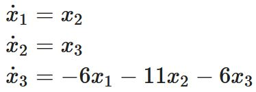
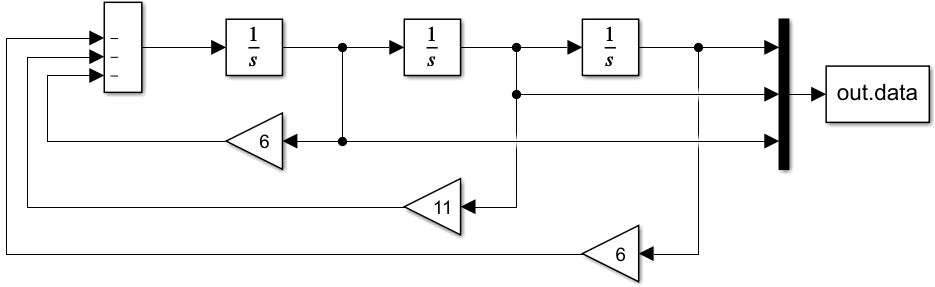
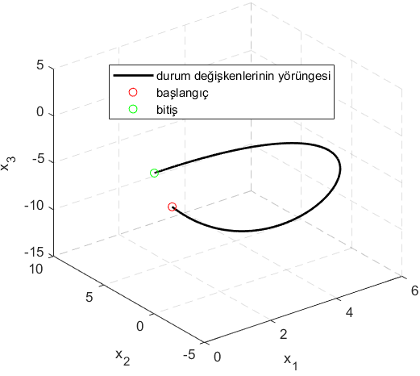

# EESEC 314
## DİNAMİK SİSTEM
Gerilim kaynağı bağlanmış bir resistör-kapasitör devresini (RC devresi - **Şekil 1**) analiz ettik. Burdaki örnekte kapasitörün üzerinden geçen akım i<sub>C</sub>(t) değil de kapasitörün üzerine düşen voltaj V<sub>C</sub>(t) **durum değişkeni** olarak vazife görüyor. Analitik çözümü [1]'de türetilen *RC devresinin zorlanmış cevabına* bakıp sistemlice düşünerek niçin akımın değil de voltajın durum değişkeni seçildiğini anlamamız gerekiyor. Aşağıda verilen kapasitörün matematiksel modelin bakıp düşünelim.

</br>
</br>
Burada bir ip ucu: Türev anlık bilgi verirken (geçmişe bir bağımlılığı yok) integral'de başlangıç koşulu söz konusudur ve bu başlangıç koşuluna göre sistemin girişi aynı olsa bile sonuç farklı olabilmektedir.</br>
**Durum değişkeni:** *Geçmişin geleceği etkileyen özü*<sup>1</sup>.</br>
Bu hafta baktığımız RC devresinin durum uzayı modelinde bir tane **durum değişkeni** var, dolayısıyla bir boyutlu bir sistem. Ayrıca *Vcc* olarak isimlendirdiğimiz güç kaynağının gerilimi (devreyi bir sistem olarak görürsek) sisteme bir **giriş değişkeni** (input) olarak etki ediyor. RC devresinde resistör değeri *R* ve kapasitor değeri *C* sistem parametreleri olarak vazife yapıyor. Bu parametreler zamanla değişmediği zaman Sinyaller-Sistemler dersinden bildiğimiz gibi doğrusal zamanla değişmeyen (linear time-invariant - LTI) bir sistemimiz olmuş oluyor ve sistemi analiz etmek kolay bir hal alıyor. Sistem parametrelerimiz zamanla değişen bir yapıya sahipse daha kompleks matematiksel yaklaşımlarla analiz yapmak zorunda kalırız (bu derste bu yaklaşımları öğrenmeyeceğiz).

</br>
*Şekil 1:* RC devresinin analizi. Burada incelenen cevaba RC devresinin *zorlanmış* cevap denmektedir [1]. 
## Sarkaç (Pendulum) Sistemi
**Pendulum** (sarkaç) dinamiklerine durum uzayında (state space) bakış [1]. *Şekil 2*'de görüldüğü üzere, kütlesi ihmal edilen *l* uzunluğundaki çubuğun ucundaki cismin kütlesi *m*, sürtünme katsayısı *b*, yer çekimi ivmesi *g*; sistem parametreleri denilen bu katsayılar sabit (i.e., zamanla değişmiyor). Sistemin durum değişkenleri açı ve açısal hız. Çıkış değişkeni olarak açıyı gözlemliyoruz.

</br>
*Şekil 2:* Pendulum (sarkaç) modeli ([2]'nin izni ile).

Burada analiz ettiğimiz pendulum probleminde sistemimizin bir girişi yok. Gerçek hayatta çubuğun ucuna pervaneli bir motor takılıp çubuğu hareket ettirebilir veya çubuğun baş noktasında (yani döndüğü yerde olan eksen etrafında) bir adım (step) veya servo motor pendulumu döndürebilir. Motorların dönmesiyle sisteme etki edecek olan kuvvet sistemimize bir giriş olarak etki edecektir. Bu konuya altıncı haftada dönüp burada bahsettiğimiz sistem giriş değişkenini (input variable) yani kontrol sinyalini bir denetleyici (e.g., PID) vasıtasıyla oluşturduk.
**Not:** Ara sınavda sarkaç sisteminden soru vardı ama sorulan soruda kontrol sinyali yoktu. Final sınavında *Şekil 3*'de gösterildiği gibi kontrol sinyali u(t)'nin mevcut olduğu geri-beslemeli bir kontrol sistemi karşımıza çıkacaktır. Derste bu sistemin denklemlerini türetip MATLAB Simulink'de gerçekledik. Ama derste A, B ve C matrislerini ve de sistemin transfer fonksiyonunu türetmedik. Final sınavında bunlar ile ilgili sorular gelecektir.

</br>
*Şekil 3:* Pendulum (sarkaç) modelinin MATLAB Simulink'de gerçeklenmiş hali (Final sınavında karşımıza çıkacak).
## ARABA DİNAMİĞİ
### Hız (Cruise) Kontrol
Bir arabaya Newton'un F=ma kanununu uygulayarak elde edeceğimiz dinamik modeli inceleyelim. **Durum uzayı gösterimi** (state space representation). Ayrıca oransal-integral-türevsel (proportional-integral-derivative) denetleyici (PID controller) tasarlayarak (deneme-yanılma yolu ile) arabamızın hız kontrolünü yapmaya çalışalım.

</br>
*Şekil 4:* Araba hız kontrolü (cruise control) dinamikleri ([3]'ün izni ile). Burada sönümleme katsayısı b arabayı durdurucu etki yapıyor.

A matrisi sistem matrisimiz, B matrisi giriş matrisi, C matrisi çıkış matrisi olarak isimlendiriliyor. Eğer bir sistemin dinamikleri doğrusal (linear) ise o zaman sistemin zaman alanındaki (time-domain) modelini yukarıda geçen matrisler ve giriş, durum ve çıkış değişkenleri cinsinden **durum uzayı gösterimi** (state space representation) ile tasvir edebiliriz. Bu hafta zaman alanından (time domain) frekans alanına (s domain) geçiş yaptık. Sistemimizin çıkışı (y(t)) olan arabamızın hızı (v(t)) ile girişi (u(t)) olan arabayı çeken kuvvet arasındaki orana s alanında (s-domain) bakarsak transfer fonksiyonu T(s)'yi elde ediyoruz.

T(s) = Y(s)/U(s) = C(sI-A)<sup>-1</sup>B + D

Dersimizin sonunda her hafta yaptığımız gibi incelediğimiz modellerin MATLAB/Simulink'de simulasyonlarını yaptık. Durum uzayındaki çıkış değişkeni olan arabanın hızının, s-alanında Transfer fonksiyonu ile verilen bloğun çıkışı olan hız değişkeni ile tamamen aynı olduğunu gözlemledik. Dersimizi önümüzdeki hafta sistemin çıkışını hız değil de pozisyon (arabanın konumu) olarak seçip yeni bir transfer fonksiyonu elde edeceğiz diye sonlandırdık.
### Pozisyon Kontrol
Cruise kontrol problemindeki arabanın dinamikleriyle (*Şekil 3*) devam ettik. Çıkış olarak hızı değil de pozisyonu seçerek konum bilgisinden geri-besleme aldık. Böylece sistemimizin transfer fonksiyonu da değişmiş oldu. Hatırlayacak olursak **transfer fonksiyonu** s-uzayında (yani frekans uzayı/alanı) çıkışın girişe oranı olarak tanımlanmıştı, dolayısıyla çıkışın başka bir durum değişkeni seçilmesi otomatik olarak transfer fonksiyonunun ifadesinin de etkiledi. Yeni elde ettiğimiz transfer fonksiyonuna dikkat edilecek olursa, paydadaki ifadenin maksimum derecesi iki, yani ikinci dereceden bir polinom. Bu da yeni elde edilen transfer fonksiyonunda iki tane kökün olduğunu gösteriyor. Bu iki kök, iki durum değişkenine (i.e., hız ve pozisyon) tekabül ediyor. Ayrıca PID denetleyicimizin kazançları da yeniden ayarlanmak zorunda kaldı, çünkü artık üretilen kontrol sinyali hız kontrol probleminde olduğu gibi arabayı sabit bir hıza sabitlemeye çalışmıyor fakat arabanın konumunu (pozisyonunu) tek boyutlu kabul ettiğimiz yolda belirli bir referans noktasına/çizgisine götürmeye çalışıyor.
## Pendulum (Sarkaç) - devam
İkinci haftada dinamiklerine göz atıp matematiksel modelini birinci dereceden adi diferansiyel denklemler kullanarak elde ettiğimiz pendulum (sarkaç) problemine geri dönüyoruz. Bu sefer sisteme durum uzayı gösteriminde giriş değişkeni işlevi görecek harici bir kuvveti bir eyleyici (actuator) vasıtasıyla uygulayacağız. Mesela sistemin moment noktası olan ekseni, bir servo veya adım (step) motorun miline geçirebiliriz ve böylece bu eksene uygulayacağımız Tork (Newton x metre) [4] veya *l* uzunluğundaki kütlesi ihmal edilen çubuğun ucundaki *m* kütleli yükün olduğu noktaya bir motor-pervane ikilisi takıp, motor-pervane eyleyicisinin *m* kütlesinin olduğu noktada oluşturacağımız itki kuvveti ile sisteme etki edebiliriz.</br>
Derste yukarıda anlattığımız güncellemeyi sarkaç sistemine uygulayıp yine bir PID denetleyici tasarlayarak açıyı kontrol etmeyi başardık. Ara sınavımızda karşımıza çıkacak bir sistem. Unutmayın, şu ana kadar baktığımız RC devresi ve araba hız ve pozisyon kontrolü problemlerinde sistemler doğrusaldı. Bu yüzden transfer fonksiyonlarını elde edebiliyoruz bu sistemler için. Fakat sarkaç sisteminde açı durum değişkeninin durum uzayı gösteriminde yazdığımız birinci dereceden diferansiyel denklemlerde görünme şekli sinüs fonksiyonu üzerinden olduğu için sistemimiz doğrusal değil demiştik. Sonuç olarak da sarkaç sisteminin transfer fonksiyonu söz konusu değil. Önümüzdeki hafta ilk hafta işlediğimiz (DBS'de ders kaydı yok ilk haftanın) ve ikinci hafta derste sarkaç sistemi ile devam etmeden kısaca tekrar ettiğimiz RC devresinin durum uzayı gösterimine tekrar göz atıp bu elektronik devrenin/sistemin transfer fonksiyonunu elde edeceğiz. Ardından şu ana kadar tasarladığımız PID denetleyicilerden daha ilkel olan **aç/kapa denetleyici**<sup>2</sup> ile sistem çıkışımız olan kapasitör voltajı olan V<sub>C</sub>(t)'yi kontrol etmeye çalışacağız.   
## RC Devresi - devam
Tahtada durum uzayı gösterimini tekrar yazacağımız RC devresinin transfer fonksiyonunu dördüncü haftada öğrendiğimiz</br>
T(s) = Y(s)/U(s) = C(sI-A)<sup>-1</sup>B + D

</br>
eşitliğini uygulayarak aşağıdaki gibi elde ettik (dersin tam sonuna denk geldi).

</br>
Transfer fonksiyonunun paydası **birinci** dereceden bir polinom şeklinde, bu da **bir** durum değişkenimiz olduğunu gösteriyor. Zaten bizim RC devresindeki durum değişkenimiz kapasitörün üzerindeki voltaj V<sub>C</sub>(t).
## Root Locus (Kök Yer Eğrisi)
Önceki dönemlerdeki **EESEC 305 Kontrol Sistemleri I** ve **EESEC 314 Kontrol Sistemleri II** derslerinde geri-beslemeli bir kontrol sisteminin blok diyagramına göz atmıştık. Burada hatırlamak gerekirse, kontrol edilmek istenen sistem doğrusal ise o zaman *Şekil 5*'deki gibi bir akış diyagramına sahip oluruz. 


*Şekil 5:* Doğrusal bir sistem üzerinde geri-beslemeli kontrol.

Burada durum uzayı modelimizin matrisleri 


olarak verilirse o zaman sistemin transfer fonksiyonu


olarak hesaplanabilir. Burada 3x3'lük matrisin tersini alma işlemi ve diğer matris çarpma işlemlerini derste MATLAB'da hem hazır hem de kendi yazdığımız komutlarla gerçekledik. Daha önce her zaman incelediğimiz sistemlerin transfer fonksiyonarını elde ettik. Burada **Kök Yer Eğrisi** konusunda kontrol etmek istediğimiz dinamik sistemin değil de geri-beslemeli kontrol sisteminin tamamının transfer fonksiyonu ile ilgileniyoruz. Başka bir deyişle, çıkış sinyalimiz Y(s)'nin referans sinyalimiz R(s)'ye oranını bulup K kazancındaki değişimin transfer fonksiyonuna etkilerini (yani sistemin cevabındaki değişimi) gözlemlemek istiyoruz. Sistemin çıkışının girişe oranı olan Y(s)/U(s) ifadesini bulduk. Kontrol sinyali U(s) ile hata sinyali E(s) arasında 

U(s) = KE(s) 

şeklinde bir ilişkinin olduğunu *Şekil 5*'den de faydalanarak görebiliriz. Böylece 

U(s)/E(s) = K 

buluruz. Blok diyagramdan 

E(s) = R(s) - Y(s) 

olduğunu da görebiliriz. Sonuç olarak R(s) ile Y(s) arasında matematiksel bir ifade bulmak istediğimizden ilk önce U(s)/E(s) = K ifadesinde E(s) yerine R(s) - Y(s) ifadesini koyalım ve 

U(s) / (R(s)-Y(s)) = K 

elde edelim. Başka bir ifadeyle 

U(s) = K(R(s) - Y(s))

olur. Bu ifadeyi de Y(s)/U(s) ifadesinde yerine koyarsak 

Y(s) / K(R(s) - Y(s)) = 1/s(s+1)(s+1) 

olur. İçler dışlar çarpımıyla devam edersek 

Y(s)s(s+1)(s+2) = KR(s) - KY(s) 

elde ederiz. Buradan da 

*Şekil 5*'de görülen geri beslemeli kontrol sisteminin tamamının transfer fonksiyonu olan R(s)/Y(s) ifadesini 

R(s)/Y(s) = K / s(s+1)(s+2)+K 

olarak buluruz. Görüldüğü gibi bu transfer fonksiyonunun kutupları (paydanın kökleri) kazanç K değiştikçe değişmektedir. İşte **Root Locus** grafiği K kazancı değiştikçe kutupların aldığı konumların çizimidir.

### Aç-Kapa Denetleyici
Aç-kapa denetleyiciyi tasarlamadan önce araba hız kontrolü örneğine geri dönelim ve orada PID denetleyici yerine ilkel bir denetleyici olan aç-kapa denetleyici koyalım. Bakalım hız ve pozisyon kontrolü problemlerinde sistemimizin çıkışı olan hız ve pozisyonu kontrol edebilecek miyiz yoksa edemeyecek miyiz. Farz edelim kontrol ettik; çıkış istediğimiz davranışı gösteriyor mu yoksa göstermiyor mu, ona da bakalım. Unutmayalım, aç-kapa kontrolün çıkışını simüle ederken gerçek hayatta bu sinyalin uygulanabilirliğini göz önünde bulundurmamız gerekecek. Derste **bang-bang** kontrole de bakıp pratik bir araba kontrolü ile ilgili örnek videolar izleyeceğiz. Aç-kapa kontrol de kapalı halde sistemimize bir kontrol sinyali uygulamazken, bang bang kontrolde açıkken uygulanan sinyalin tam tersi uygulanıyor.

## Kendi-Kendini Dengeleyen Robot ve PID Kontrolör
Geribeslemeli bir kontrol sisteminin<sup>4</sup> blok diyagramına<sup>5</sup> *Şekil 6*'de görülen kendi-kendini dengeleyen robot üzerinden bir bakış.

 

*Şekil 6:* Kendi-kendini dengeleyen robot ve üzerinde koşan geri-beslemeli kontrol sistemine bir bakış.

Derste PID kontrolörün girişi olan hata sinyali e(t) ile çıkışı olan kontrol sinyali u(t) arasındaki ifadeyi sürekli zaman için aşağıdaki gibi elde ettik.


## Ayrık Zamanda PID Kontrolör
PID kontrolörün (*Şekil 6*'de görüldüğü gibi kendi-kendini dengeleyen robot için) Arduino üzerinde ayrık zamanda (discrete time) nasıl gerçeklendiğini anlamaya nümerik integrale bakarak başlıyoruz.

</br>
*Şekil 7:* Kendi-kendini dengeleyen robotun, üzerinde yer alan Arduino'da koşan PID kontrolör ile yere düşmeden dengede kalarak ilerlemesi.

</br>
*Şekil 8:* Arduino üzerinde koşan PID kontrolörün integral kontrol kısmının ayrık zamanda *Backward Euler* tekniği ile gerçeklenmesi. İntegrali alınacak sinyalin/değişkenin bulunduğumuz anda değeri mevcut ise (e.g., burada bulunduğumuz an t = 4T, integralini aldığımız sinyal e(t) dolayısıyla e(4T) değerinin bulunan anda mevcut olup olmadığına bakıyoruz) o zaman o değer ile örnekleme periodu (sampling period) çarpılarak en son dikdörtgenin alanı hesaplanır ve bir önceki anda hesaplanan değere (burada e(3T)) eklenir.
### Üçüncü dereceden zorlanmamış bir dinamik sistemin Simulink'de gerçeklenmesi
Aşağıda durum uzayı denklemleri verilen sistemi Simulink'de kurduk.

</br>
Sistemin Simulink'de gerçeklenmiş hali *Şekil 9*'deki gibidir.

</br>
*Şekil 9:* Derste gerçeklediğimiz üçüncü dereceden dinamik sistemin Simulink'deki görünümü.

</br>
*Şekil 10:* Derste gerçeklediğimiz üçüncü dereceden dinamik sistemde durum değişkenlerinin yörüngesi.

Sistemin denge noktası (equilibrium point) sıfır olduğundan durum değişkenlerini nereden başlatırsak başlatalım sonuç her zaman

 

olacaktır.
### Simulink'de kullandığımız integratörleri kullanmadan sistemin benzetiminin yapılması
*Şekil 8*'nin açıklamasında *Backward Euler* yani *geriye doğru Euler* tekniğinde integrali alınan sinyalin/değişkenin o andaki değerine sahip olunması şartından bahsetmiştik. Burada incelediğimiz zorlanmamış sistem simülasyonunda, herhangi bir durum değişkeninin o andaki değeri hesaplanırken öbür durum değişkenlerinden en az birisinin o andaki değerine ihtiyaç duyuluyor, bu yüzden de mecburen *Forward Euler* yani *ileri Euler* tekniğini kullanmak zorundayız.
#### MATLAB'da Forward Euler tekniği ile nümerik integral alarak dinamik sistem simülasyonu yapmak
```
T = 0.01; % örnekleme periyodu
stopTime = 10; % son zaman
t = 0:T:stopTime; % zamanı oluşturalım
x0 = [13, 18, -12]; % başlangıç koşulları
x1(1) = x0(1); x2(1) = x0(2); x3(1) = x0(3);
% forward euler tekniği ile nümerik integral alarak dinamik sistemi koşturalım
for i = 2:length(t)
    x1(i) = x1(i-1) + x2(i-1)*T;
    x2(i) = x2(i-1) + x3(i-1)*T;
    x3(i) = x3(i-1) - (6*x1(i-1) + 11*x2(i-1) + 6*x3(i-1))*T;
end
```
Yukarıda verilen kod<sup>6</sup> koşturulduğunda, bize *Şekil 8*'i veren 
```
plot3(x1,x2,x3)
```
komutuna ek olarak
```
plot(x1,t)
plot(x2,t)
plot(x3,t)
```
komutlarıyla *Şekil 10*'da çizdirilen durum değişkenlerinin zamanla değişimini gösteren grafikleri elde ettik. Dikkat edin, *Şekil 8*'de zaman yokken *Şekil 10*'da zaman söz konusu. *Şekil 8*'ye faz portresi (phase portrait) deniyor.
</br>
*Şekil 11:* Zorlanmamış sistemin durum değişkenlerinin zamanla değişimleri.

### Nümerik Türev
Aşağıdaki kodu<sup>7</sup> oluştururken örnekleme frekansının (dolayısıyla da örnekleme periyodunun) sinyalin üzerindeki etkisine şahit olduk. Örnekleme periyodu 10ms olduğunda görüntülediğimiz sinyalin sinüse benzer bir yanı yoktu. Örnekleme frekansının artırdığımız (yani örnekleme periyodunu düşürdüğümüzde) işte o zaman yavaş yavaş sinüse benzer şeyler elde ettik ve bir değerden sonra tamamen sinüs gibi gözükmeye başladı. Her ne kadar yüksek örnekleme frekansı ile çalışınca hiçbir bilgi kaybı yaşamasak da, işlemci gücümüz sınırlı olduğundan dolayı mümkün mertebe örnekleme frekansını düşük (yani örnekleme periyodunu büyük) tutmak isteriz ki mikroişlemci/mikrodenetleyici üzerindeki işlem yükümüz az olsun. 
```
T = 0.001; % örnekleme periyodu
stopTime = 0.04; % 2 periyoda bakalım
t = 0:T:stopTime;
f = 50; % frekans - Hz
A = 220;
y = A*sin(2*pi*f*t);
y_turev = A*cos(2*pi*f*t)*2*pi*f;
y_numerik_turev = zeros(1,length(t));
y_numerik_turev(1) = 70000;
for i=2:length(t)
    y_numerik_turev(i) = (y(i) - y(i-1)) / T;
end
```
</br>
*Şekil 12:* Priz sinyali Asin(2πft) formunda olup genlik 220V, frekansı ise 50Hz'dir. Kırmızı renkle gösterilen grafikte priz sinyalinin türevini matematiksel olarak 2πfAcos(2πft) formunda elde ettik ve çizdirdik. Mavi grafikte ise yukarıda kodda görüldüğü gibi sinyalin o andaki örneğinden bir önceki örnekteki değerinin farkını alıp geçen zaman olan örnekleme periyoduna böldük ve türev operatörünün nümerik halini gerçekledik. Başlangıç koşulunu uygun değere ayarladığımızda mavi ile kırmızı grafiklerinin bütün örnekler (for all samples) için aynı olduğunu görülebiliyor.
## Hareket Sensöründen Açının Hesaplanması
Bu hafta genel olarak geri-beslemeli kontrol sistemlerinde, özel olarak da Kendi-Kendini Dengeleyen Robot üzerinde sensörleri (algılayıcıları) konuşacağız. Hareket sensörü olan **MPU6050** ile ham ciroskop ve ivmemetre verisinden ilk önce tamamlayıcı süzgeç (**complementary filter**) algoritması ile ardında da özel bir Bayesian süzgeç olan **Kalman Filtresi** ile açının tahmin edilmesi (estimation) konularına bakacağız.
## Dipnotlar
<sup>1</sup> Bu tanım [5] tarafından [6]'dan alınmıştır.</br>
<sup>2</sup> İng. **On-off controller**. Aynı zamanda **bang bang** kontrol olarak da bilinse de aralarında ufak bir fark vardır.</br>
<sup>3</sup> İng. **Controller**. Aynı zamanda denetleyici de denir.</br>
<sup>4</sup> İng. **Feedback control system**.</br>
<sup>5</sup> Blok diyagram yerine akış diyagramı (flow chart) tabiri de kullanılır.</br>
<sup>6</sup> Bu kod yukarıdaki **kod** dizininde **self_coded_hypothetical_dynamic_system.m** dosyasında verilmiştir.</br>
<sup>7</sup> Bu kod yukarıdaki **kod** dizininde **numerical_derivative.m** dosyasında verilmiştir.
## Kaynaklar
[1] RC, RL ve RLC devrelerinin analizi - https://github.com/taha-koroglu/RLC_devreleri</br>
[2] Pendulum dinamiği - https://www.mathworks.com/help/ident/ug/classical-pendulum-some-algorithm-related-issues.html</br>
[3] Araba dinamiği (hız ve pozisyon kontrolü problemi için) - https://ctms.engin.umich.edu/CTMS/index.php?example=CruiseControl&section=SystemModeling</br>
[4] Tork nedir? - https://tr.khanacademy.org/science/physics/torque-angular-momentum/torque-tutorial/v/introduction-to-torque</br>
[5] M. Ö. Efe, *Otomatik Kontrol Sistemleri*, 4. Baskı, Seçkin Yayıncılık, Eylül 2020.</br>
[6] A. Dervişoğlu, *Lojik Devre Tasarımı Ders Notları*, İTÜ Elektrik-Elektronik Fakültesi, 1992.

## Video
Bu sayfa ile ilgili bilgi edinmek için aşağıdaki resime tıklayarak videoyu izleyebilirsiniz.</br>
[](https://youtu.be/5p5_AzG9l2o)
